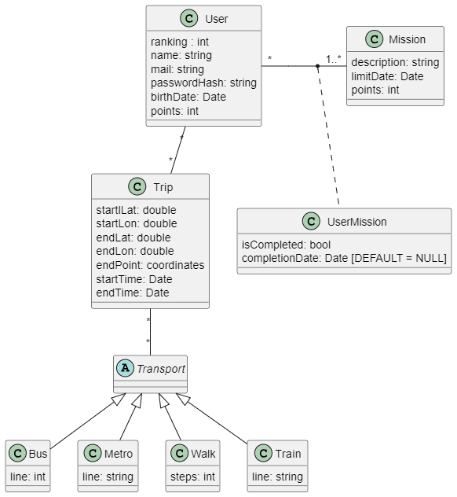
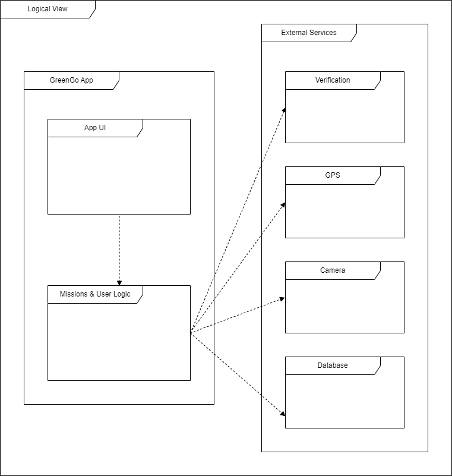
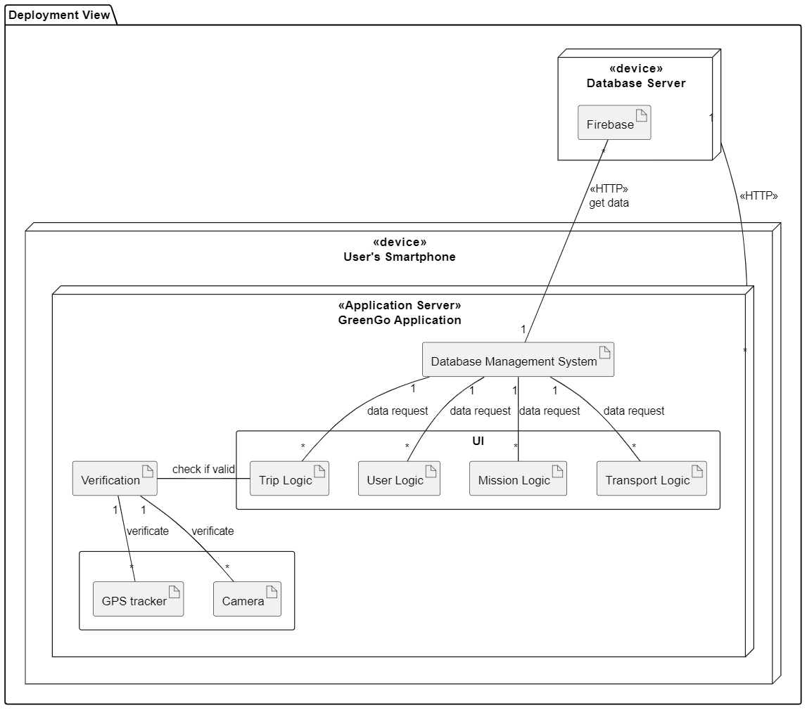
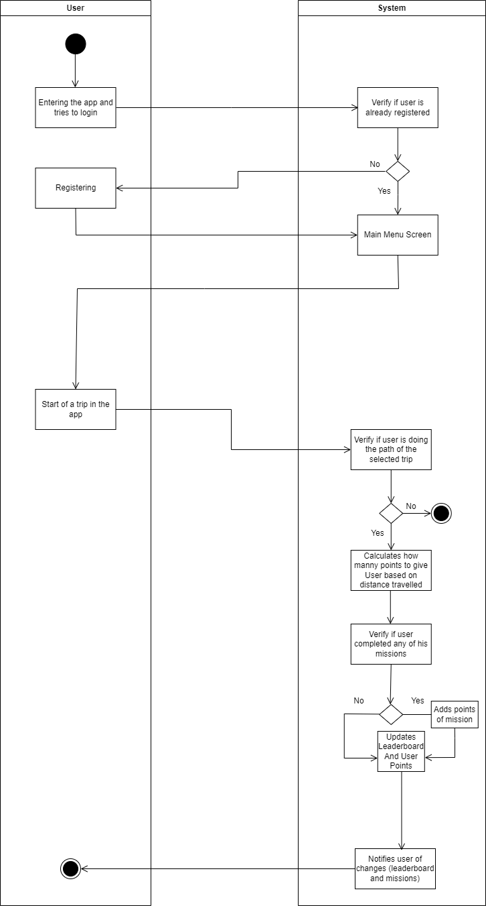

# _GreenGo_ Development Report

Welcome to the documentation pages of _GreenGo_!

You can find here details about _GreenGo_, from a high-level vision to low-level implementation decisions, a kind of Software Development Report, organized by type of activities:

This project is part of the Software Engineering UC.
The main goal is to build a mobile app that addresses the sustainable development in the context of the academic community.
The app will try to encourage the FEUP community to have better practices regarding sustainable development.

* [Business modeling](#business-modelling)
  * [Product Vision](#product-vision)
  * [Features and Assumptions](#features-and-assumptions)
  * [Elevator Pitch](#elevator-pitch)
* [Requirements](#requirements)
  * [User stories](#user-stories)
  * [Domain model](#domain-model)
* [Architecture and Design](#architecture-and-design)
  * [Logical architecture](#logical-architecture)
  * [Physical architecture](#physical-architecture)
  * [Vertical prototype](#vertical-prototype)
* [Project management](#project-management)
* [Notes for the teacher](#important-notes)

Contributions are expected to be made exclusively by the initial team, but we may open them to the community, after the course, in all areas and topics: requirements, technologies, development, experimentation, testing, etc.

Please contact us!

Thank you!

* **Lucas Faria** (up202207540)

* **Pedro Borges** (up202207552)

* **Manuel Mo** (up202205000)

* **Rafael Campeão** (up202207553)

* **Alexandre Lopes** (up202207015)

* **Diogo Santos** (up202009291)

## Business Modelling

### Product Vision

For FEUP students who need an incentive to use transports in a sustainable way, GreenGo is a smartphone app that turns sustainable mobility into a game. Unlike our competitors this product gives users rewards and badges for their efforts while helping them build good habits.

### Features and Assumptions

#### Features

* **Point System** - A system that rewards the user when he uses sustainable means of transport.

* **Leaderboard** - A leaderboard system that shows the top community members in terms of points. The members in the top of the leaderboard may receive some prizes.

* **Selection of transports** - The user can select some different means of transport to start counting the points/receive the points.

* **Verification** - Users need to give some information to the system so that it can verify if the travel was made using sustainable means of transport.

* **Missions** - Users can complete some missions that will reward them with some extra points.

* **Customizable Profile** - Users can customise their profile (username, date of birth, ...)

* **Mission History** - Users can see their completed missions.

#### Dependencies

* Firebase FireStore for storing users and missions data
* Firebase Storage for storing user profile pictures and other images and icons used in the app
* Firebase Authentication for user authentication and registration
* GPS location (Flutter Geolocator Plugin) for trip verification
* Camera (Flutter Camera Plugin) for trip verification

### Elevator Pitch

**Note:** the following section is in portuguese because it was used for pitch presentation.

Cada vez mais, estamos mais apegados aos nossos veículos pessoais, contribuindo dessa forma para o agravamento da crise ambiental. Devido a alguns inconvenientes como o maior tempo de viagem e menor conforto no uso de transportes mais sustentáveis, temos dado preferência ao uso dos nossos veículos privados. Mas como podemos tornar o uso de transportes sustentáveis mais interessante? A nossa app soluciona este problema tornando as viagens sustentáveis em um jogo competitivo entre os utilizadores. Cada viagem é recompensada com pontos. Todos os utilizadores competem pelos melhores lugares num leaderboard de pontuações. Além disso, existem várias missões e achievements que recompensam os utilizadores pelo seu esforço. Assim, se quiserem tornar as vossas viagens mais sustentáveis mas ao mesmo tempo querem que estas não sejam entediantes, a app GreenGo é a solução.

## Requirements

### User Stories

The user stories can be seen in our [Github Projects board](https://github.com/orgs/FEUP-LEIC-ES-2023-24/projects/82).

### Domain model

**User:** Describes a user of the app (his profile), for example, his name, email, etc...

**Mission** Describes a mission/objective on the app used to receive extra points.

**UserMisson** Decribes the status of a specific misson for a specific user (if the user completed that misson or not).

**Trip** Describes the trips made by the user with some of the most important things related to them.

**Transport** List of transports such as metro, bus, walk and train.

**Achievement** Describes an achievement/feat on the app.

**UserAchievement** Describes the status of a specific achievement for a specific user (if the user completed that achievement or not).

## Architecture and Design

### Logical architecture

The GreenGo App relies on several external dependencies to enhance user experience and functionality. These include verification protocols for completed missions, GPS integration for precise point calculation, camera access to capture images for specific tasks, and a robust database system to securely store both user and mission data.

### Physical architecture

The user accesses the GreenGo app through his smartphone. Within the app they can view the leaderboard, their profile, missions, and can even use the camera and turn on the GPS. When the user wants to see some data, like their profile, the app queries the Firebase Database on the database server to retrieve the relevant information. The same process occurs if the user wishes to view the leaderboard or the missions to complete.

The camera and GPS are used for validating missions. For instance, if a user is doing a mission that involves making a trip using public transport, they utilize the GPS. The "GPS Controller" then sends the GPS data to the verification system for validation. The same goes to the camera. The user takes pictures to prove the completion of the mission and then the "Camera Controller" sends it to the "Verification" sector.

### Other diagrams

* Sequence Diagram:

* State Diagram:

* Activity Diagram:

## Vertical Prototype

The informations related to the vertical prototype can be found [here](docs/VerticalPrototype.md).

## Project management

You can find below information and references related with the project management in our team:

* Backlog management: Product backlog and Sprint backlog in a [Github Projects board](https://github.com/orgs/FEUP-LEIC-ES-2023-24/projects/82);
* Release management: [v0](https://github.com/FEUP-LEIC-ES-2023-24/2LEIC10T2/releases/tag/v0.0.1-vertical-prototype),[v1](https://github.com/FEUP-LEIC-ES-2023-24/2LEIC10T2/releases/tag/v0.1.0-Sprint1),[v2](https://github.com/FEUP-LEIC-ES-2023-24/2LEIC10T2/releases/tag/v0.2.0-Sprint2),[v3](https://github.com/FEUP-LEIC-ES-2023-24/2LEIC10T2/releases/tag/v0.3.0-Sprint3)
* Sprint planning and retrospectives:
  * [Iteration 0](docs/Iteration0.md)
  * [Iteration 1](docs/Iteration1.md)
  * [Iteration 2](docs/Iteration2.md)
  * [Iteration 3](docs/Iteration3.md)
* Increment description:
  * [ChangeLog](docs/ChangeLog.md)
 
## Important notes
[Notes](docs/Notes.md)
