# ChangeLog

## v0.3.0-Sprint3

### Added

For this version of the app (the final sprint version) we added the final functionalities related to the missions and the achievements and also improved and polished some other details related to the app aesthetics and functionality.

Firstly, the user can now complete missions and check his completed missions. The section with the completed missions can be accessed through the profile page.

    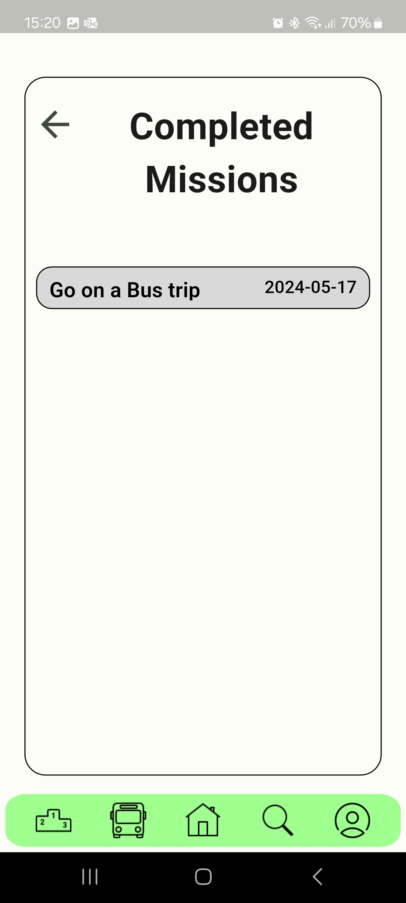

The second big functionality implemented was the achievements/rewards system. The user can now receive achievements and rewards when he completes a certain number of missions, achieves a certain number of points or logins a certain amount of times. The achievements section can be accessed through the profile page. The achievements section is divided into completed and incompleted missions. 

    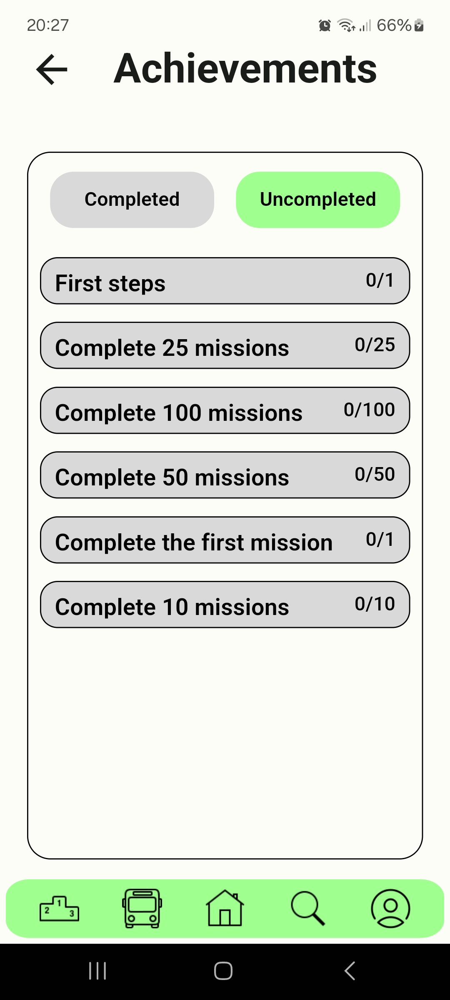

    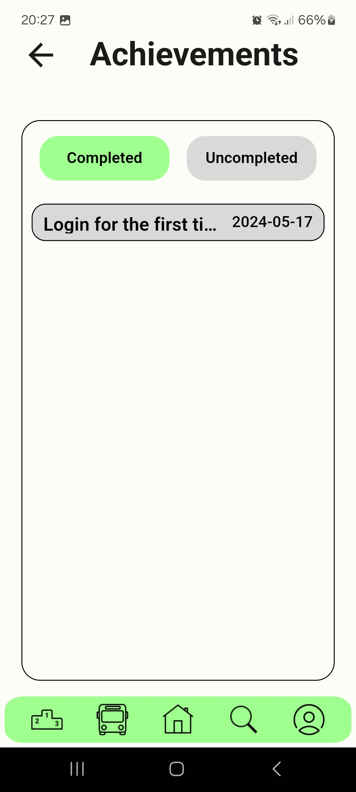

    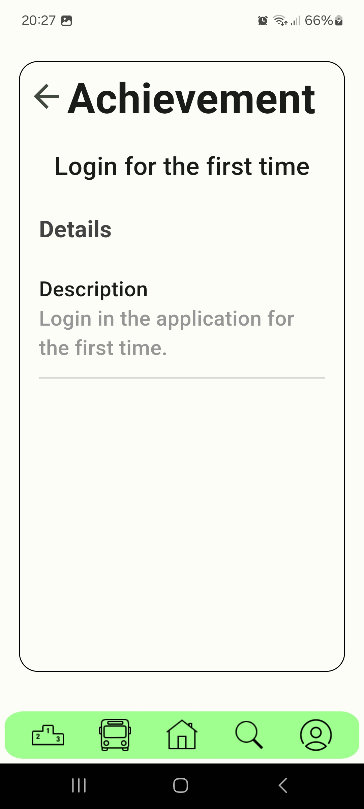

Besides the achievements and the missions systems, we also worked on some refinements to improve the user experience. 

The default animations were removed from the page transitions. 

The circle with the completion percentage of the current score goal has now a different color that contrasts better with the background. 

    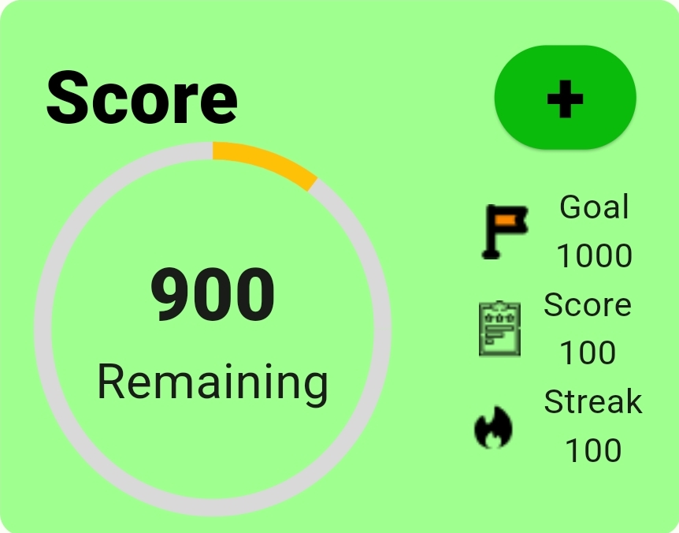

The dividers in the missions details have now a less agressive color. 

    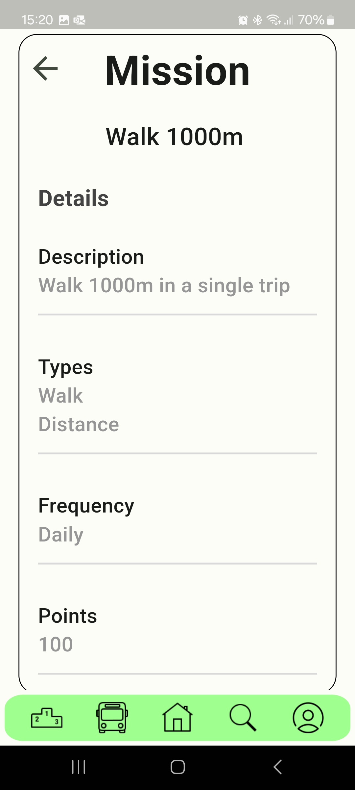

The dividers in the score details page have now also a less agressive color.

    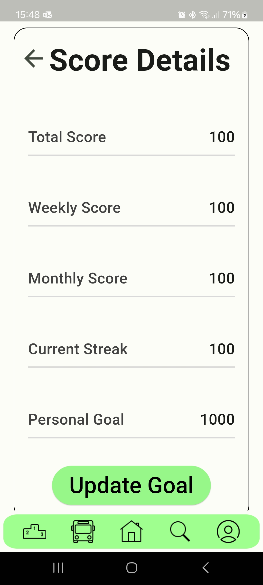

Lastly, the profile page was also a bit refined with a small improvement in the profile details board, a new top bar with the username and a button to access the pop menu that contains the logout, delete account and edit profile options.

    

### Fixes

There were no fixes made in this version.

## v0.2.0-Sprint2

### Added
In this version of the app, among other things, we added the score widget, where users can easily see their goal from the main
page, the remaning score that is necessary to reach it, score, and streak.
Futhermore, the plus button at the top takes the user to the score page where more detail is provided
and users can update their goal.

    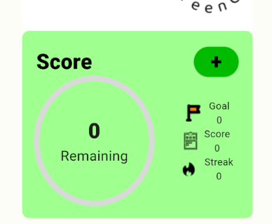

    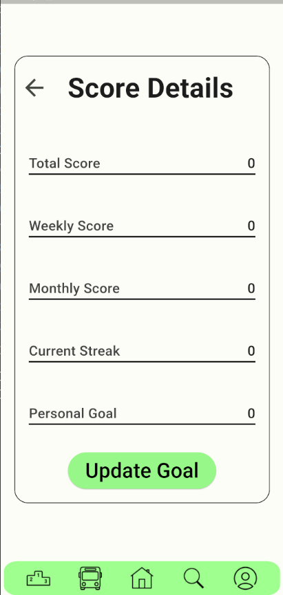

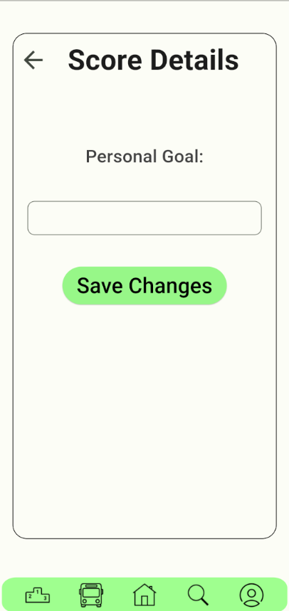

We have also added a mission widget where users can view ongoing missions.
Clicking on any mission displays its details on a dedicated page. Similar to the score widget,
we've added a plus button that, when clicked, directs users to the search page, where they
can look for new missions.

    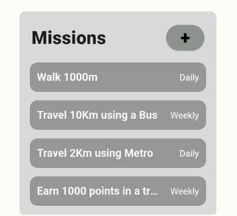

    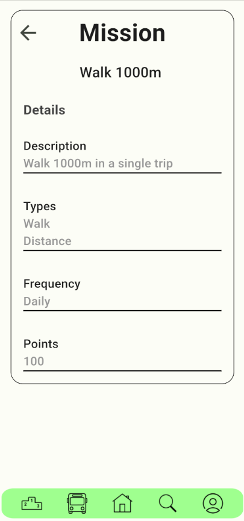

    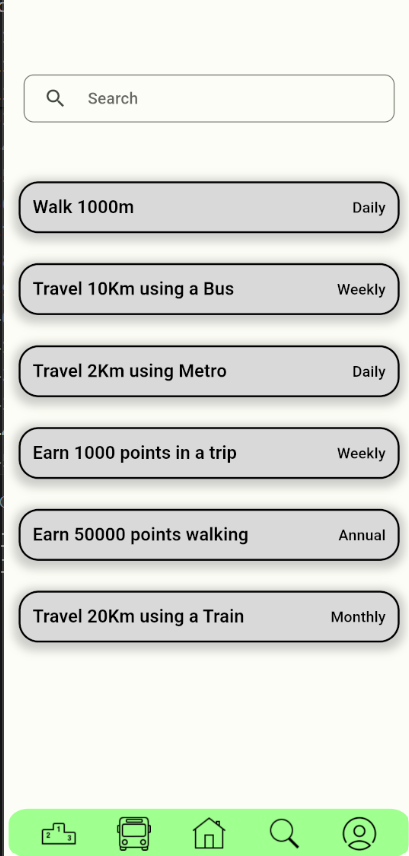

The profile options are condensed in a separate menu, a logout button was added
and a warning is displayed when the delete account button is pressed.

    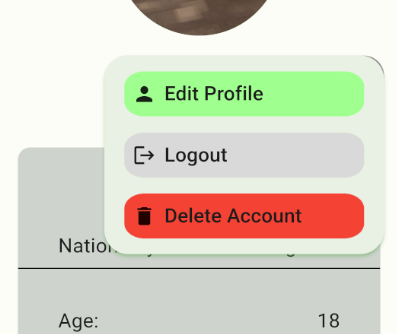

    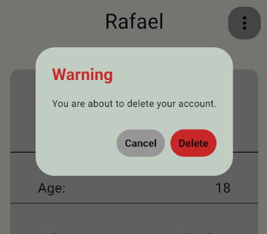

The leaderboard is now completely functional, with three 
different tables: weekly, monthly and all time.

    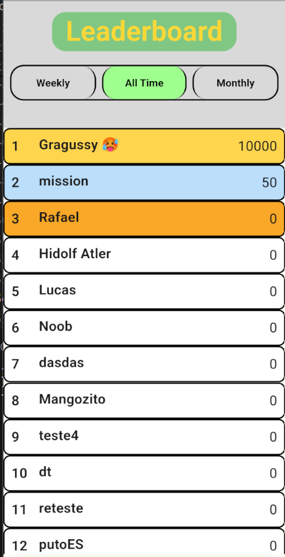

### Fixes

* Fixed bug where account would not be deleted if user had updated their profile.

## v0.1.0-Sprint1

### Added

In this version, we implemented the following features:

* User account registration: User can now create a new account to use the app.
* User Login: Users can now login into their account to access the app.
* Sustainable transports page and all the pages related to them (verification pages): Users can now use the app to register their trips and start earning points.
* User profile page: Users can now access their account information such as their name, job, ...
* User edit profile page : Users can now edit their profile information.
* Menu Bar: A user-friendly menu bar was implemented to help users navigate through the app.

### Fixes

There were no fixes made in this version.

