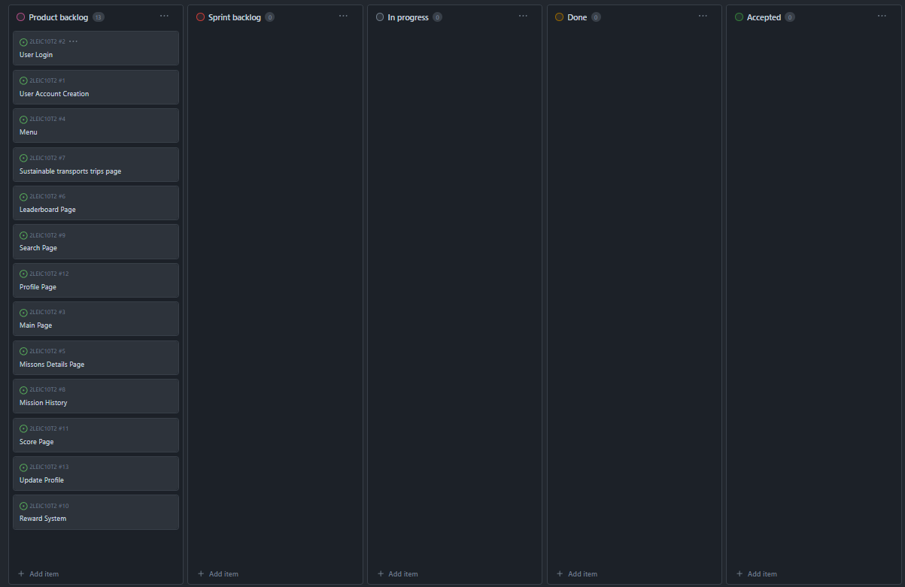

# Iteration 0 Log

## Release

[Latest Release](https://github.com/FEUP-LEIC-ES-2023-24/2LEIC10T2/releases/tag/v0.0.1-vertical-prototype)

## Sprint Retrospective

### What went well?

- Every issue was correctly created;
- The team cooperated well and everyone was able to contribute to the project;

### What should we do differently?

- This week everything went according to plan as we accomplished every goal we had set for ourselves. We should keep up the good work and continue to work as a team.

### What still puzzles me?

- How to verify that the user actually used public transportation to get to the destination.
- Understanding the issues related to externals APIs.

## Project Board

### Beginning of the sprint

* We did not have a board at the beginning of the sprint.

### End of the sprint

