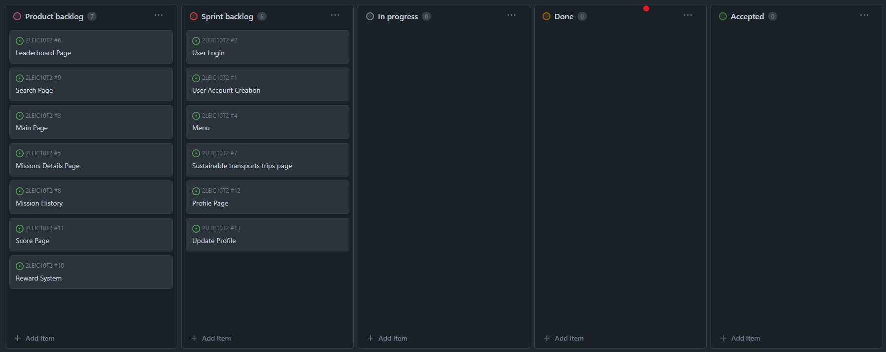
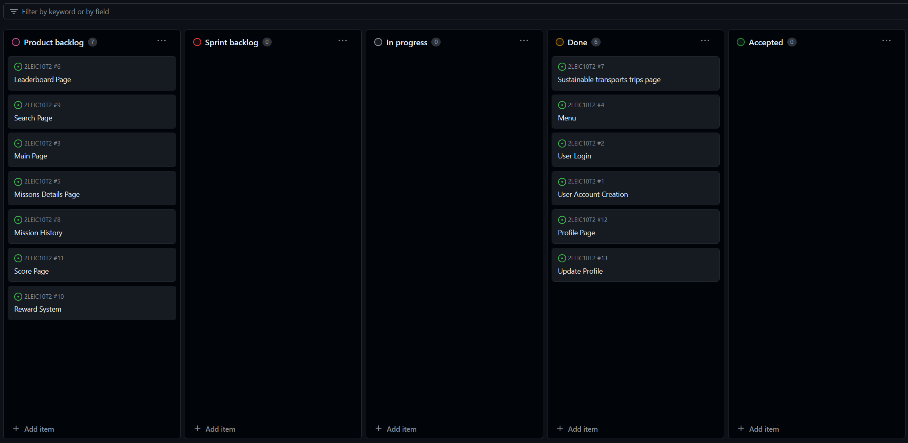

# Iteration 1 Log

## Release

[Latest Release]()

## Sprint Retrospective

### What went well?
- Every proposed issue (user story) was completed
- Every team member contributed to the Sprint in different areas

### What should we do differently?

- We should put more work on testing
- But, in general we should continue the good work that has been done.

### What still puzzles me?

- The flutter tests (unit tests) have caused a lot of problems. We couldn't find out how to run the test with some of the dependencies we use.
- The acceptance tests couldn't be automated.

## Project Board

### Beginning of the sprint

### End of the sprint

