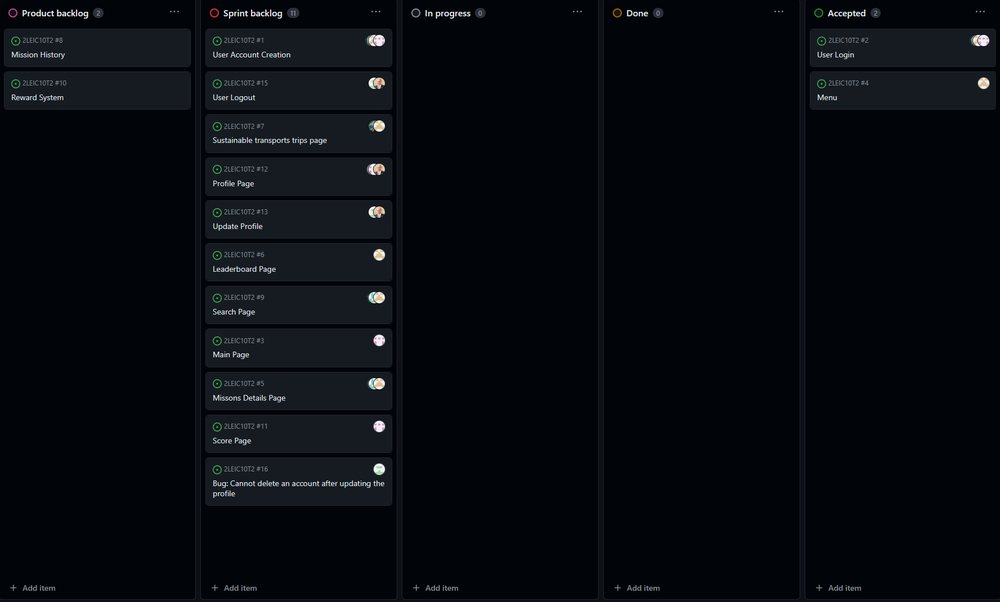
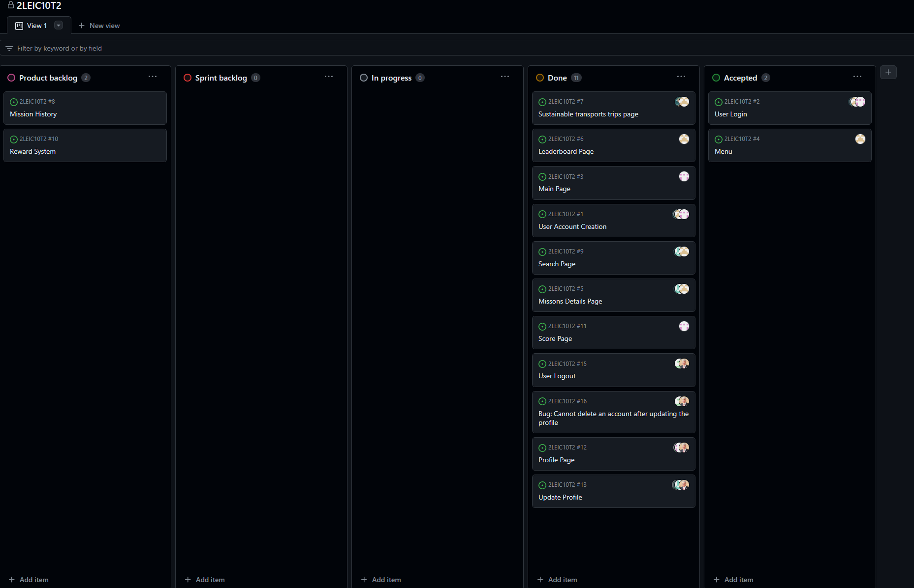

# Iteration 2 Log

## Release

[Latest Release](https://github.com/FEUP-LEIC-ES-2023-24/2LEIC10T2/releases/tag/v0.2.0-Sprint2)

## Sprint Retrospective

### What went well?
- We completed every proposed issue.
- Every one worked hard to complete this sprint.
- The unit tests worked well this time.

### What should we do differently?
- We should distribute better the work in some situations.

### What still puzzles me?
- The unit tests related to the camera and the location services are basically impossible to test because these services need some functions and methods that cannot be mocked (for example, the available cameras method).
- The acceptance tests are still not automated because of the compability problems between flutter gherkin and dart3.

### How are we going to improve?
- We will distribute better the work between the team, avoiding excessive work for some team members.
- We will try to find some possible solutions to the camera tests and location tests. This could envolve on making integration tests that will test other functions beyond the one we want to test.

## Project Board

### Beginning of the sprint

### End of the sprint

