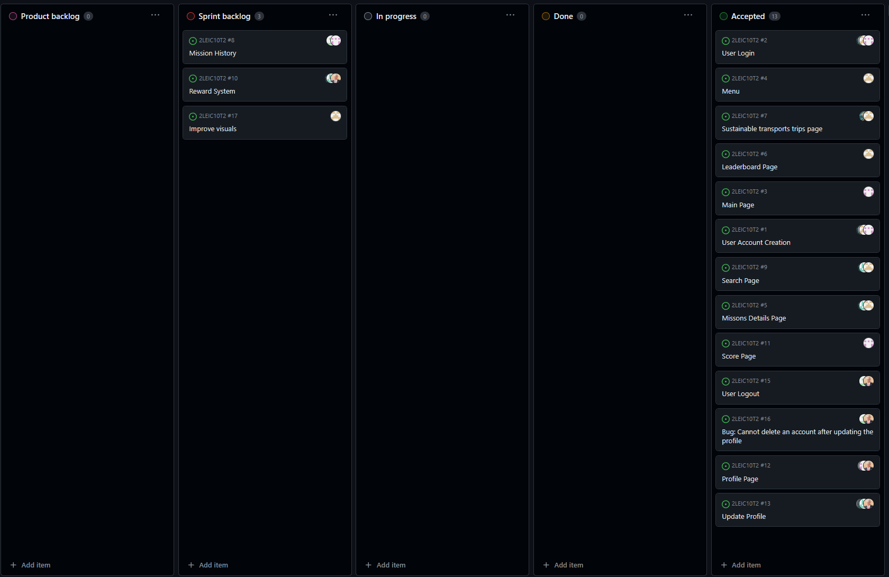
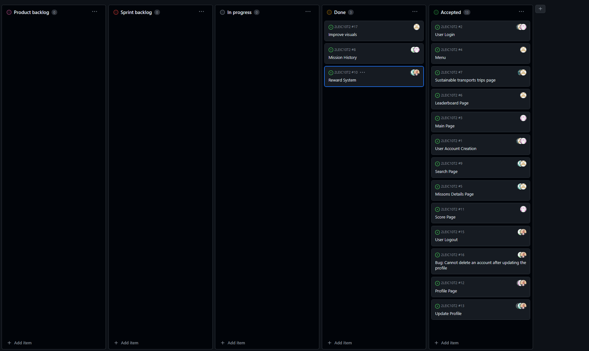

# Iteration 3 Log

## Release

[Latest Release](https://github.com/FEUP-LEIC-ES-2023-24/2LEIC10T2/releases/tag/v0.3.0-Sprint3)

## Sprint Retrospective

### What went well?
- We completed everything we proposed for this sprint.
- Every team member worked in this sprint.
- The work was well distributed among the team.

### What should we do differently?
- We should better manage our time because we had a lot of work for the other courses and the quality of our work was affected by that. To improve this topic, we should plan our schedule better as a team in order to avoid conflicts between the team members and their work for the other courses.

### What still puzzles me?
- The problems with the unit tests and the acceptance tests from the last sprint continued on this sprint.

## Project Board

### Beginning of the sprint

### End of the sprint

