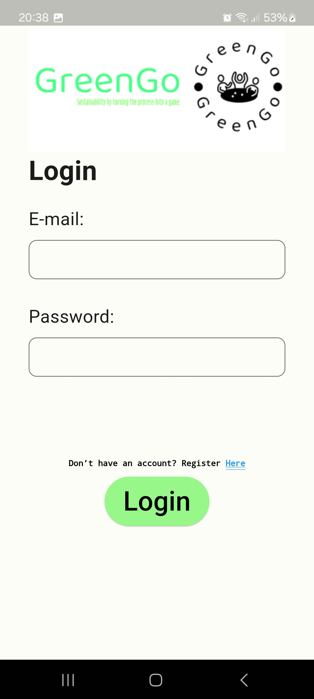
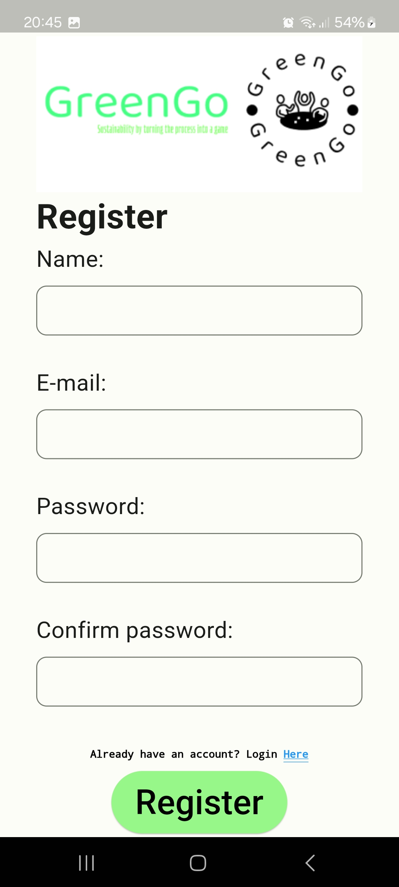
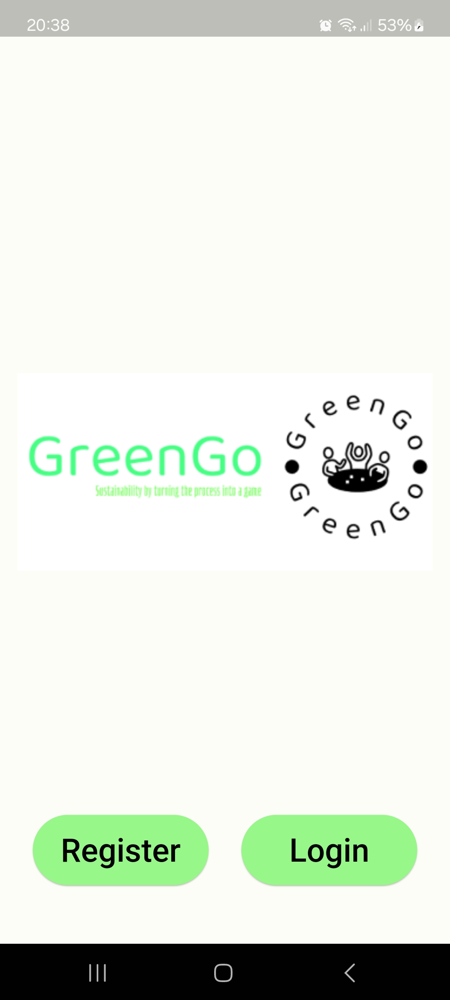
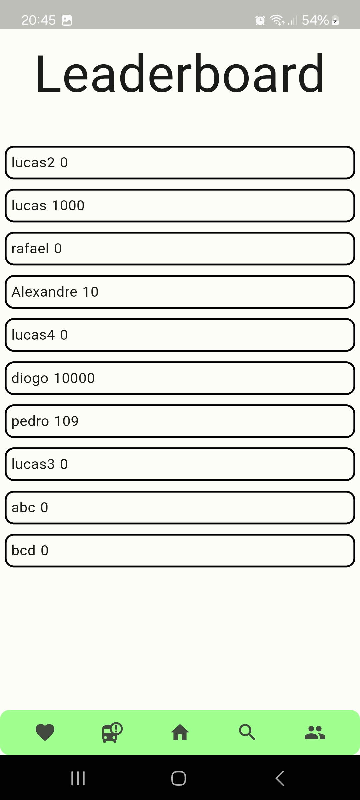
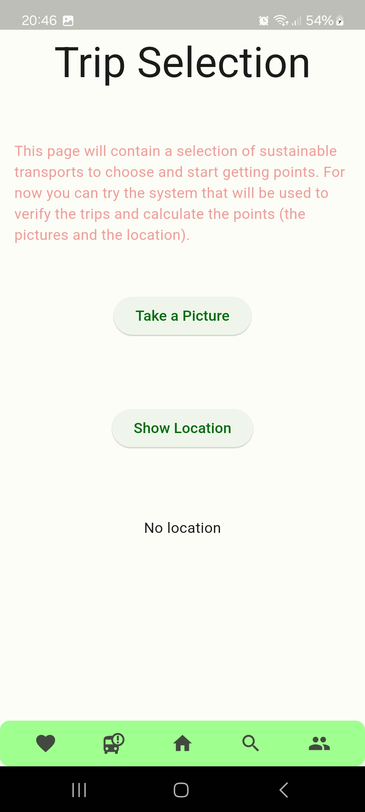
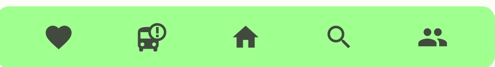
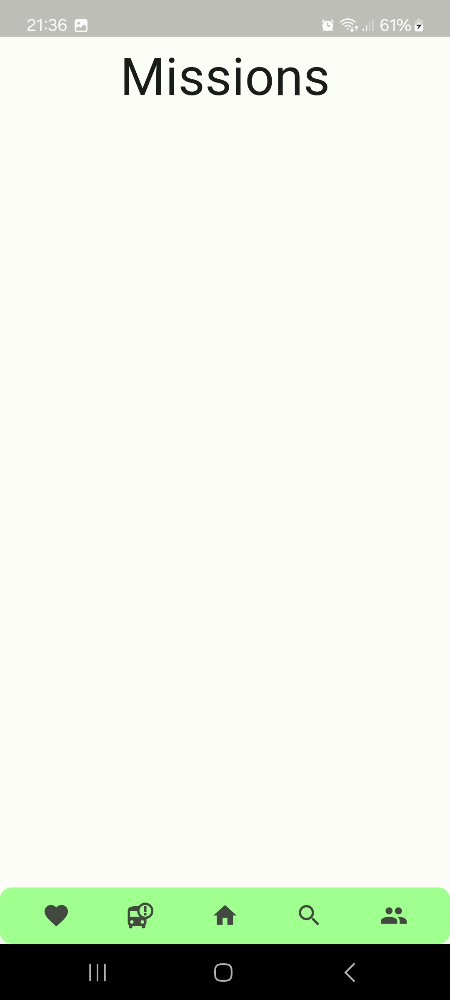
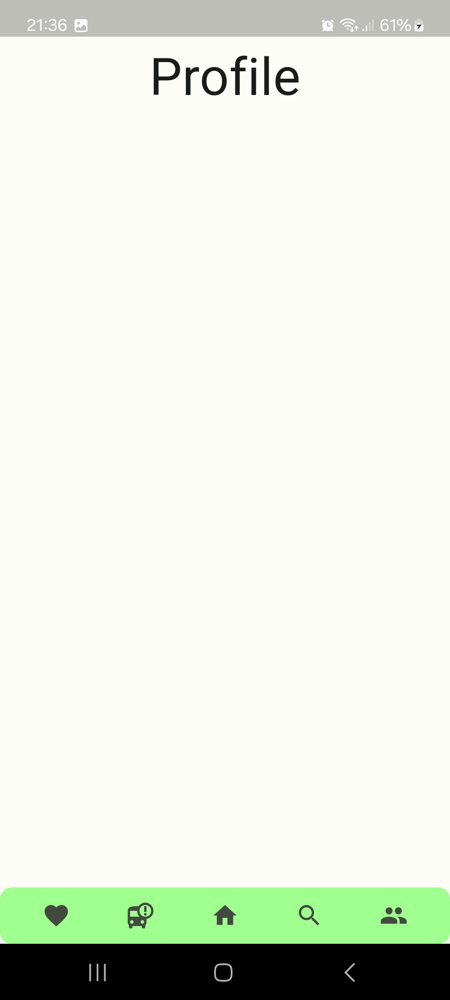
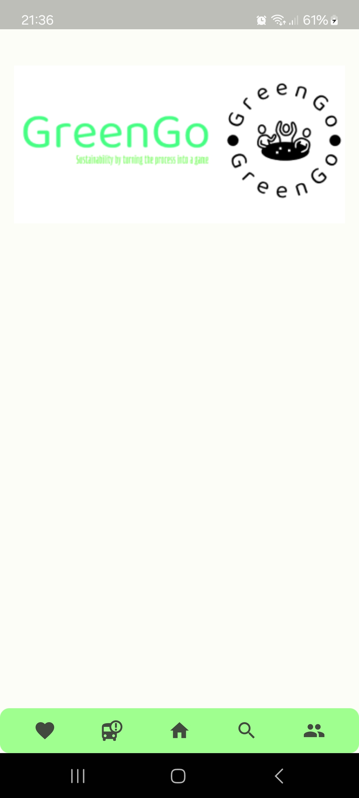

## Vertical prototype

In the vertical prototype we implemented the following features:

* **Login Page:**
  * **User Story:** As a user that has already signed up I want to login in my account so that I can access it and the app's contents.
  * **Implementation:** In the prototype, this feature is basically completed. Only some minor visual enhancements could be made for the final version.
  * **Screenshot:**
  
    

* **Register Page:**
  * **User Story:** As a new user I want to sign up for the app so that I can participate in the challenges.
  * **Implementation:** This feature is basically completed. Only some minor visual enhancements could be made for the final version.
  * **Screenshot:**
  
    

* **Start Page:**
  * **User Story:** As a new user I want to sign up for the app so that I can participate in the challenges. As a user that has already signed up I want to login in my account so that I can access it and the app's contents.
  * **Implementation:** This feature is basically completed (we can access the login and register). Only some minor visual enhancements could be made for the final version.
  * **Screenshot:**

    

* **Leaderboard:**
  * **User Story**: As a user I want to check the leaderboard so that I can see my current position in it along with the points of other users.
  * **Implementation:** The system already connects with the Firebase Firestore database and fetches the users data. However, the users aren't ordered by the number of points and the visuals are different from what we expect for the final version.
  * **Screenshot:**

    

* **Trip Page:**
  * **User Story:** As a user I want to check a trip using public transports
so that I can receive points.
  * **Implementation:** In this prototype, this page is only used to demonstrate the technologies that will be used to verify the trips (GPS location and camera pictures).
  * **Screenshot:**

    

* **Menu Bar:**
  * **User Story:** As a user I want to have a menu so that I can go see my profile, the leaderboard, all the missions, the main page and the bus page.
  * **Implementation:** The menu bar is fully functional but the visuals aren't what we expect for the final version.
  * **Screenshot:**

    

* **Search Missions page:**
  * **User Story:** As a user I want to be able to search for specifics missions/mission types to be able to more effectively gain points
  * **Implementation:** The page only has the title and the menu bar already enables the user to access this page. However it doesn't have any of the main features implemented.
  * **Screenshot:**

    

* **Profile Page:**
  * **User Story:** As a user I want to access my user profile so that I can check my personal information.
  * **Implementation:** The page only has the title and the menu bar already enables the user to access this page. However it doesn't have any of the main features implemented.
  * **Screenshot:**

    

* **Main Page:**
  * **User Story:** As a user I want to have a main page so that I can check out my score, streak and how many more points I need to complete my current goal as well as a few missions that are available to be completed.
  * **Implementation:** The page only has the app logo and the menu bar already enables the user to access this page. However it doesn't have any of the main features implemented.
  * **Screenshot:**

    
